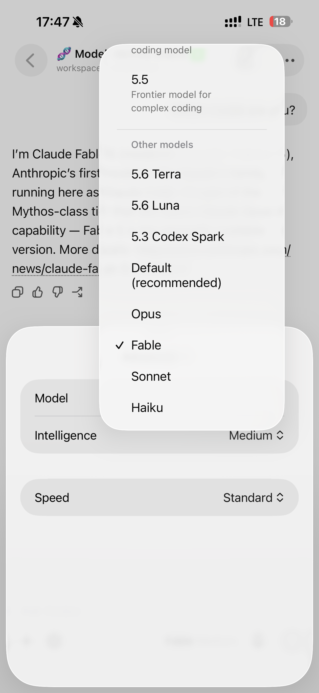
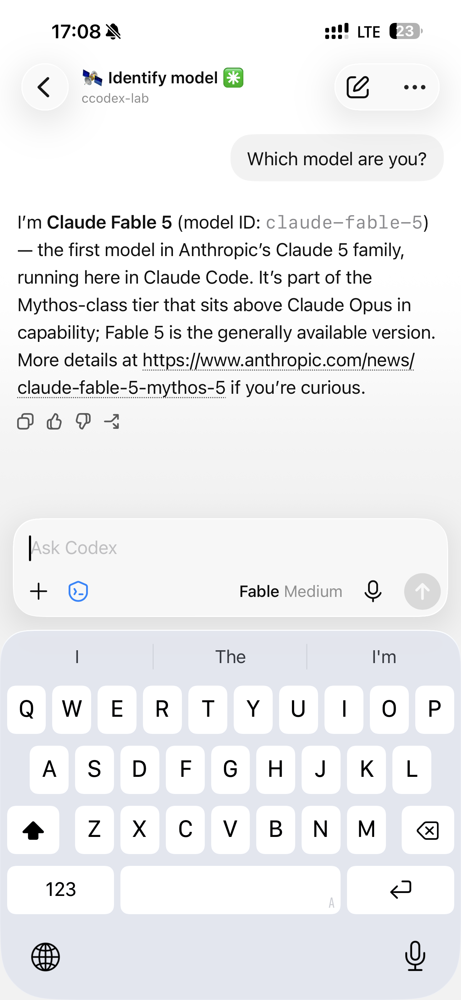
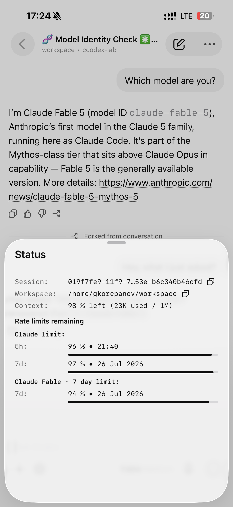

<div align="center">

# Claude Code'x

**Claude models inside the official Codex App.**

*Claude Code'x — or just **CCodex** — is a compatibility bridge that teaches the
Codex desktop and mobile apps to run Claude models.*

</div>

```sh
curl -fsSL https://github.com/gkorepanov/ccodex/releases/latest/download/install.sh | sh
```

> [!NOTE]
> CCodex is an independent, unofficial, community project. It is not affiliated with,
> sponsored, or endorsed by OpenAI or Anthropic. *Codex*, *Claude*, and related marks
> belong to their respective owners.

---

## Why

Want Fable and Opus writing your code, but can't stand the Claude Code app? Same.
The Codex App is everything it isn't: a genuinely great agentic UI with remote
sessions from desktop and mobile that just *work*, from anywhere. CCodex is the
missing bridge.

## What you get

- 🤖 **Claude models in the official Codex App** — `claude:*` models appear right in
  the stock model picker, next to `gpt-*`.
- 📱 **Rock-solid remote sessions** — drive Claude tasks from the Codex App and the
  official ChatGPT mobile app over SSH, exactly the way you already use OpenAI models.
- 🔀 **Seamless provider switching** — jump between OpenAI and Claude mid-project with
  a compact context handoff, so your chat doesn't start from zero.
- ⚡ **Native-feeling Codex features** — threads, turns, tools, approvals, `/compact`,
  Fork, effort and fast-mode settings all work with Claude models like they were built in.
- 📊 **Status commands** — `/ccstatus` shows provider health and quotas for ❋ Claude
  and ֎ Codex; `/ccstate` shows the current task's model, context, traffic, cost, and
  session stats.
- ✨ **Bonus: better thread titles** — threads in the Codex App get auto-named in a
  fun, readable way with an emoji prefix, so you can tell them apart at a glance.
  Want your own naming style? Drop any custom prompt into `~/.ccodex/config.toml`.

### Not a hack

CCodex is **not** a Codex harness bolted onto a reverse-engineered Anthropic
subscription. It is the **native Claude Code harness** (official Claude Agent SDK +
Claude Code runtime), surfaced through the excellent Codex App UI. You log in to each
provider with its own official CLI, and no Anthropic or OpenAI terms are violated.

### 100% local, 100% open source

CCodex sends **nothing anywhere**. There are no CCodex servers, no telemetry, no
proxies of ours in the middle — traffic goes over the exact same infrastructure the
stock Claude CLI and Codex CLI already use, straight to the providers. Everything else
lives on your machine, and the entire codebase is MIT-licensed and open.

## Project status

> [!WARNING]
> CCodex is very early and not extensively tested yet. Expect bugs — and please
> [report them](https://github.com/gkorepanov/ccodex/issues).

## Screenshots

<p align="center">
  
  
  
</p>

## Install

The one-liner above is all you need. Prefer npm?

```sh
npm install -g @gkorepanov/ccodex
ccodex setup
```

Provider login is optional at install time — add or repair it whenever:

```sh
ccodex auth codex
ccodex auth claude
ccodex setup
```

Keeping it healthy, updated, or removing it:

```sh
ccodex doctor            # (or --json)
ccodex update            # npm latest; --check / --channel next / rollback available
ccodex uninstall         # preserves config and state; add --purge --yes to wipe
```

The release asset also ships a matching `uninstall.sh` that works even if your shell
`PATH` no longer resolves `ccodex`.

## How it works

CCodex owns the SSH-side `codex app-server` command and preserves the Codex App's
full thread / turn / tool / approval lifecycle, while delegating ordinary Codex CLI
commands to your global Codex installation:

- `codex app-server`, `proxy`, and `daemon ...` always run on CCodex's **pinned**
  runtime; everything else goes to your external Codex CLI.
- Native `gpt-*` models remain completely stock; `claude:*` entries run on Claude Code.
  Claude effort and fast mode map from Codex reasoning / priority settings.
- Switching providers on the next message creates a compact context handoff behind
  the scenes; same-provider model changes stay in-place.
- Codex approval modes map cleanly onto Claude permissions: *Full Access* →
  `bypassPermissions`, *Ask for approval* → `default`, *Approve for me* → `auto`.
- In Claude tasks, `/compact <prompt>` performs real prompted Claude compaction while
  projecting the native Codex `contextCompaction` lifecycle. Stock tasks are untouched.

Setup is deliberately **fail-closed and transactional**: it validates the platform,
exact runtimes, and provider availability before atomically activating a new version.
A failed install or update leaves your previous version and daemon running, and a
failed readiness check after switching rolls back automatically.

## Technical details

| | |
|---|---|
| **CCodex** | `0.4.0` |
| **Embedded Codex CLI** | `0.144.6` (pinned; a newer global Codex never replaces it) |
| **Claude Agent SDK / Claude Code** | `0.3.215` / `2.1.215` |
| **Runtime** | Node.js `>=22.13 <27`, npm `>=10` |
| **Platforms** | macOS 11+ (arm64) · Linux arm64 & x64, glibc ≥2.31 (Ubuntu 22.04+, Debian 11+, Fedora/RHEL equivalents). Alpine/musl not supported |
| **Shells** | Bash, Zsh, Fish |
| **Relay** | Prebuilt per-platform `@gkorepanov/ccodex-relay-*` optional packages — installs never compile Rust or native addons |

Fresh setup writes the editable title prompt to `~/.ccodex/config.toml`:

```toml
rename_prompt = """
Create a concise, vivid, memorable title for the task.
Start with exactly one rare, expressive, context-relevant emoji followed by one space.
Avoid generic decorative emoji when a more specific symbol fits.
Keep the complete title, including emoji, within 36 characters.
Return only the title.
"""

[features]
status_command = false # forward /ccstatus and /ccstate to the provider as plain messages
```

Remove or comment out `rename_prompt` for byte-compatible stock Codex title generation.
Setup never restores a prompt removed from an existing config. These settings never
disable provider routing, lifecycle/protocol fidelity, permission mapping, or visible errors.

RPC capture is on by default under `~/.ccodex/state` (mode `0600`, rolls at a combined
1 GiB) and includes prompts/outputs unless you configure otherwise — and it never
leaves your disk.

Client quirk worth knowing: the built-in `/status` differs by client (Mobile consumes
provider-labelled quota events; Desktop may render its own OpenAI-account view).
`/ccstatus` is the client-independent source of truth.

## Development

```sh
npm ci --ignore-scripts
npm run check
npm test
npm run test:contracts
npm run test:public-package
```

Release workflows build and execute all three native relay packages, publish platform
packages before the main package, generate checksums / SBOM / notices, and use npm
trusted publishing with provenance.

<div align="center">
<sub>Claude Code'x is an independent open-source project — not affiliated with, sponsored, or endorsed by OpenAI or Anthropic.</sub>
</div>
