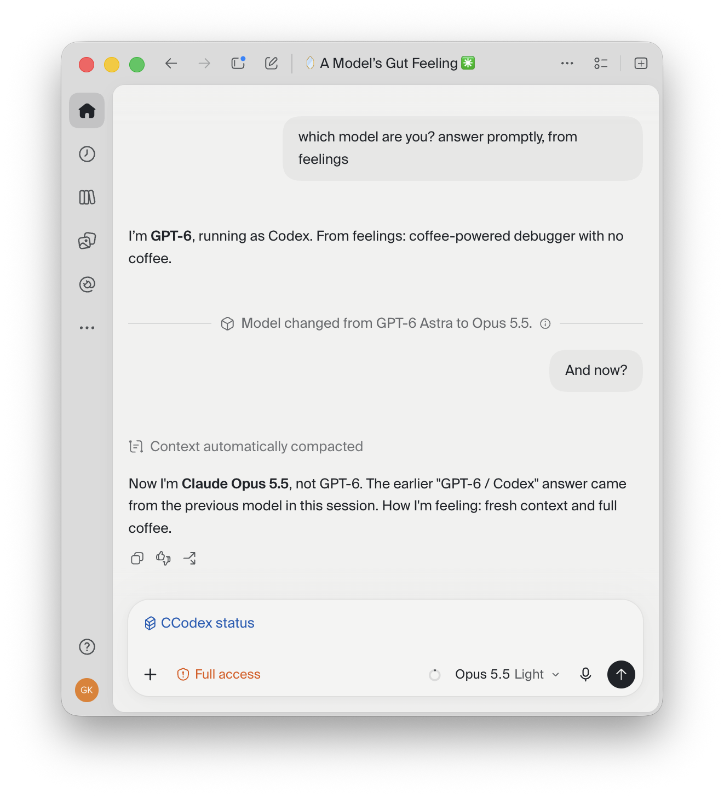
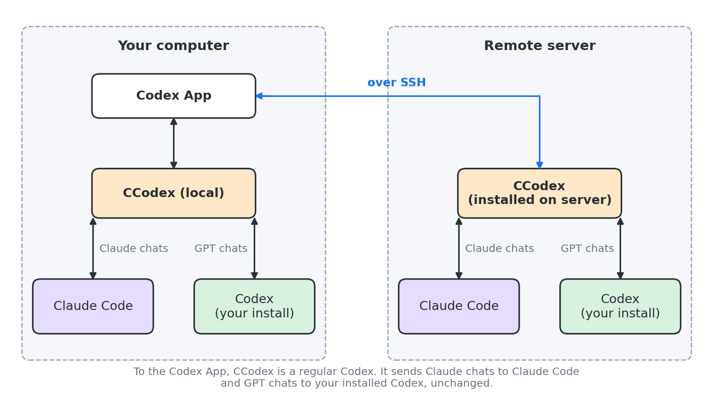

<div align="center">

# Claude Code'x

**Claude models in the Codex App, next to GPT.**

</div>

<p align="center">
  
</p>

CCodex lets you pick Claude in the Codex App's model picker. Claude chats run on real
Claude Code with your own Claude subscription, and GPT chats keep running on your Codex
as before. It works in the desktop app, on servers you open over SSH, and from the
ChatGPT app on your phone.

**Install**

```sh
curl -fsSL https://github.com/gkorepanov/ccodex/releases/latest/download/install.sh | sh
```

**Update**

```sh
ccodex update && codex app-server daemon restart
```

Then quit and reopen the ChatGPT desktop app.

> [!NOTE]
> An unofficial community project, not affiliated with OpenAI or Anthropic. It's young,
> so expect bugs, and please [report them](https://github.com/gkorepanov/ccodex/issues).

## What you get

- **Claude next to GPT** in the model picker, with Claude's effort levels and Fast mode.
- **Switch models mid-chat.** Move a chat from GPT to Claude or back, and it carries on
  where it was.
- **The App works as usual** in Claude chats: approvals, Plan mode, sub-agents, images,
  `/goal`, side chats, editing and forking messages.
- **Your phone too.** With remote control on, the ChatGPT mobile app drives Claude chats
  like GPT ones.
- **One history with the `claude` CLI.** A chat from the App opens with
  `claude --resume`, and your CLI sessions show up in the App.
- **`/cc`** shows the chat's model, context use and your Claude and Codex limits.

## How it works

<p align="center">
  
</p>

Install CCodex on every machine where your chats run: your computer for the local app,
and each server you open over SSH. There are no CCodex servers and no telemetry.

## Setup

You need macOS on Apple silicon or Linux (x64 or arm64, glibc 2.31+), with Node.js 22–26.
The installer adds Codex if it's missing, and Claude Code comes with CCodex.

1. **Install** with the command above, or with
   `npm install -g @gkorepanov/ccodex && ccodex setup`. Run it as your normal user, not
   with `sudo`.
2. **Log in** to whatever you aren't logged in to yet: `ccodex auth codex`,
   `ccodex auth claude`.
3. **Restart.** Open a new shell and run `codex app-server daemon restart`. Then:
   - app connected over SSH: reconnect to the server;
   - local app on a Mac: quit it with ⌘Q and open it again;
   - local app on Linux: start it with `CODEX_CLI_PATH=~/.ccodex/bin/codex`.

## If something goes wrong

- `ccodex doctor` checks the install and tells you what to run.
- `ccodex uninstall` removes CCodex (add `--purge --yes` to delete `~/.ccodex` too).
- What setup changes on your machine, settings, logs and known quirks:
  [`docs/details.md`](docs/details.md).

---

[Technical details](docs/details.md) · [Development](docs/details.md#development) · [License](docs/details.md#license)
