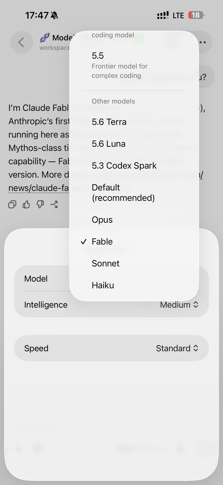
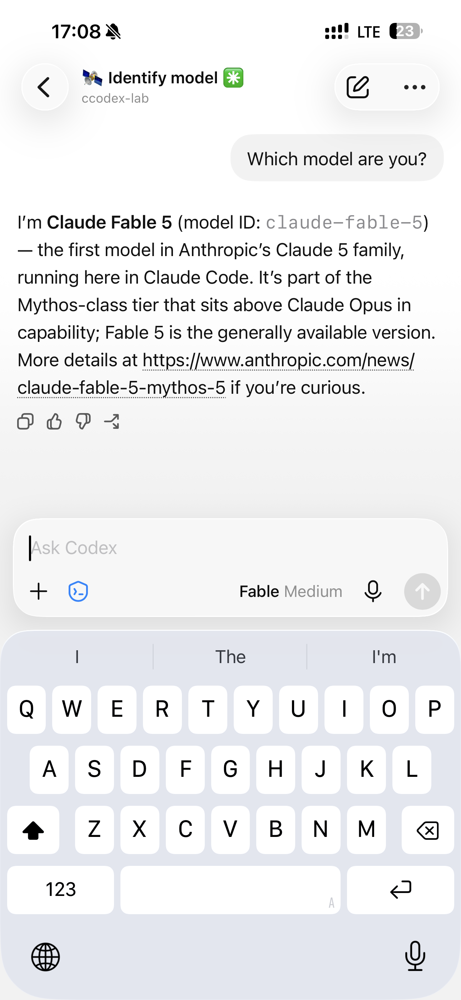
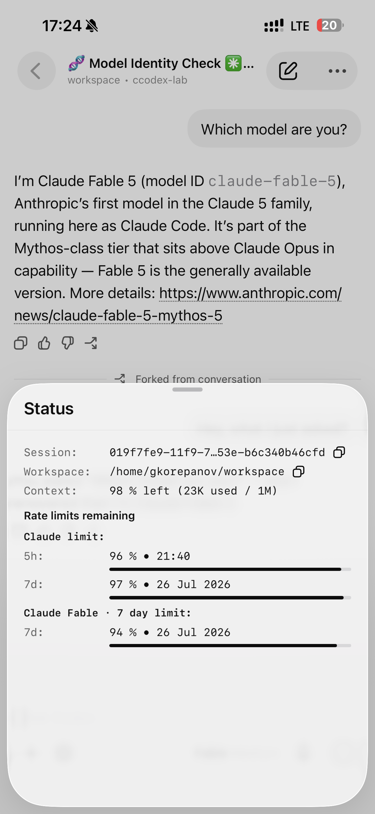

<div align="center">

# Claude Code'x

**Claude models inside the official Codex App.**

*Claude Code'x — or just **CCodex** — lets the Codex desktop app, the ChatGPT mobile app
and the Codex CLI run Claude models next to GPT.*

</div>

```sh
curl -fsSL https://github.com/gkorepanov/ccodex/releases/latest/download/install.sh | sh
```

<p align="center">
  
  
  
</p>

> [!NOTE]
> CCodex is an independent, unofficial, community project. It is not affiliated with,
> sponsored, or endorsed by OpenAI or Anthropic. *Codex*, *Claude*, and related marks
> belong to their respective owners.

---

Want Fable and Opus writing your code, but prefer the Codex App and its remote sessions
from desktop and phone? CCodex puts the **native Claude Code harness** (official Claude
Agent SDK, your own Claude login) behind that UI. GPT chats still go to your installed
Codex unchanged. No CCodex servers, no telemetry; MIT-licensed.

> [!WARNING]
> CCodex is young. Expect bugs — and please [report them](https://github.com/gkorepanov/ccodex/issues).

## How it works

<p align="center">
  
</p>

Install CCodex where your chats run: on your computer for the local Codex App, and on a
server you open over SSH. Technical details: [`docs/details.md`](docs/details.md).

## What you get

- **Claude models in the model picker**, next to `gpt-*` (ids `claude:…`), with Claude's
  effort levels and Fast mode. Codex's `ultra` effort runs Claude at `max` and has it
  delegate to sub-agents proactively, as stock does for GPT.
- **Switch providers mid-chat.** Pick a GPT model in a Claude chat (or the other way
  round) and the conversation is compacted into a summary that the other provider
  continues from. The App keeps showing one chat with one history; edits and forks across
  the switch work.
- **Codex App features on Claude chats**: approvals, Plan mode, `/goal`, `/compact`, fork,
  message edits, steering and queued messages, Stop, side chats (`/side`, served by
  Claude's `/btw`), images, Claude's questions as the App's question prompts, its task
  list as the turn's to-do list, and thinking as reasoning summaries.
- **Sub-agents and background commands like stock's**: Claude sub-agents open as their
  own threads, background shell commands show as background terminals, and messages
  between Claude chats show as the App's messages between tasks.
- **Claude skills in the `$` picker**, beside Codex skills, in Claude and GPT chats.
- **Search**: the sidebar search and find-in-chat cover Claude chats too.
- **Phone**: turn on remote control in the Codex App (or
  `codex app-server daemon enable-remote-control` on the host) and pair the ChatGPT
  mobile app as usual; it drives Claude chats like GPT ones.
- **Your `claude` CLI sessions show up** in the App, and chats from the App resume in
  `claude --resume <id>` (a Claude chat's id is its Claude session id). While another live
  Claude process has a chat open, the App can't start a turn in it.
- **Claude can delegate to Codex** through the `codex-wrapper` agent that setup installs;
  what Codex does streams into the Claude chat.
- **`/cc` status card** (also `/ccstatus`, `/ccodex`, `/ccstate`, with or without the
  slash, or *CCodex status* in the `/` menu): the chat's model, effort, permission mode,
  context use, session state, and Claude and Codex plan limits. Sent while a turn runs,
  it answers at once and never reaches the model.
- **Emoji thread titles** from a small GPT model and an editable prompt; Claude chats get
  a ` ✳️` suffix.

## Install

### Requirements

| | |
|---|---|
| **OS** | macOS 11+ on Apple silicon · Linux x64 or arm64 with glibc ≥ 2.31 (no Alpine/musl) · Bash, Zsh or Fish |
| **Node.js** | `>=22.13 <27` (22 or 24 LTS recommended), npm `>=10` |
| **Codex CLI** | any recent version; installed for you if missing. Tested with `0.156` and `0.157` |
| **Claude Code** | nothing to install: the Agent SDK brings it (`0.3.284` / Claude Code `2.1.284`) |

Don't run the installer or setup as root or with `sudo`.

### 1. Install

Either the script (it checks the platform, installs `@openai/codex` if there is no
`codex`, then runs `ccodex setup`):

```sh
curl -fsSL https://github.com/gkorepanov/ccodex/releases/latest/download/install.sh | sh
```

or npm:

```sh
npm install -g @gkorepanov/ccodex
ccodex setup
```

### 2. Log in

Skip what you are already logged in to; rerun any time:

```sh
ccodex auth codex     # codex login
ccodex auth claude    # Claude Code login (the SDK's bundled claude)
```

### 3. Activate

Open a new shell, then restart the gateway:

```sh
codex app-server daemon restart
```

- **Codex App over SSH:** reconnect to the host. The App finds CCodex's `codex` first on
  `PATH` (and at `~/.local/bin/codex`).
- **Local Codex App on macOS:** fully quit the App (`Cmd+Q`) and open it again (or log
  out and back in).
- **Local Codex App on Linux:** setup doesn't configure it; start the App with
  `CODEX_CLI_PATH=~/.ccodex/bin/codex` in its environment.

## Update, uninstall

```sh
ccodex update             # to npm latest; --check only reports, --next takes the pre-release
ccodex doctor             # health check (--json available)
ccodex uninstall          # keeps ~/.ccodex/config.toml and ~/.ccodex/state
ccodex uninstall --purge --yes   # also deletes ~/.ccodex
```

What setup changes, what uninstall undoes and upgrading from 0.4:
[`docs/details.md`](docs/details.md).

## Settings

Claude chats follow the App's own controls:

| Codex App | Claude Code |
|---|---|
| *Full Access* / *Ask for approval* / *Approve for me* | permission mode `bypassPermissions` / `default` / `auto` |
| Plan mode | permission mode `plan` |
| Reasoning effort | effort (`ultra` = `max` + proactive sub-agents) |
| Fast | Claude fast mode |

Options of `~/.ccodex/config.toml` (title prompt, log level, specific `codex` or `claude`
binaries): [`docs/details.md`](docs/details.md#config-file).

## Troubleshooting

- `ccodex doctor` checks the install and logins and says what to run.
- `codex app-server daemon restart` restarts the gateway (chats running in it stop).
- Logs, bug-report captures and known quirks: [`docs/details.md`](docs/details.md#troubleshooting).

## Development

```sh
npm ci --ignore-scripts
npm run check
npm test                  # unit and black-box gateway tests, relay tests
scripts/e2e/run.sh        # rootless podman, real models, copies of your credentials
```

## License

MIT — see [`LICENSE`](LICENSE). Third-party licenses and notices:
[`legal/LICENSES.md`](legal/LICENSES.md), [`legal/THIRD_PARTY_NOTICES.md`](legal/THIRD_PARTY_NOTICES.md).

<div align="center">
<sub>Claude Code'x is an independent open-source project — not affiliated with, sponsored, or endorsed by OpenAI or Anthropic.</sub>
</div>
